```r
library(tigerstats)
library(sqldf)
library(ggplot2)
library(nnet)
library(ROCR)
```

#Import data

```r
trainDf <- read.csv("train.csv", header = TRUE)
testDf <- read.csv("test.csv", header = TRUE)
summary(trainDf)
```

```
##       age                   workclass            education   
##  Min.   :17.00   Federal-gov     :  943   HS-grad     :9840  
##  1st Qu.:28.00   Local-gov       : 2067   Some-college:6678  
##  Median :37.00   Private         :22286   Bachelors   :5044  
##  Mean   :38.44   Self-emp-inc    : 1074   Masters     :1627  
##  3rd Qu.:47.00   Self-emp-not-inc: 2499   Assoc-voc   :1307  
##  Max.   :90.00   State-gov       : 1279   11th        :1048  
##                  Without-pay     :   14   (Other)     :4618  
##  education_num                 marital_status            occupation  
##  Min.   : 1.00   Divorced             : 4214   Prof-specialty :4038  
##  1st Qu.: 9.00   Married-AF-spouse    :   21   Craft-repair   :4030  
##  Median :10.00   Married-civ-spouse   :14065   Exec-managerial:3992  
##  Mean   :10.12   Married-spouse-absent:  370   Adm-clerical   :3721  
##  3rd Qu.:13.00   Never-married        : 9726   Sales          :3584  
##  Max.   :16.00   Separated            :  939   Other-service  :3212  
##                  Widowed              :  827   (Other)        :7585  
##          relationship                   race           sex       
##  Husband       :12463   Amer-Indian-Eskimo:  286   Female: 9782  
##  Not-in-family : 7726   Asian-Pac-Islander:  895   Male  :20380  
##  Other-relative:  889   Black             : 2817                 
##  Own-child     : 4466   Other             :  231                 
##  Unmarried     : 3212   White             :25933                 
##  Wife          : 1406                                            
##                                                                  
##   capital_gain    capital_loss     hours_per_week        native_country 
##  Min.   :    0   Min.   :   0.00   Min.   : 1.00   United-States:27504  
##  1st Qu.:    0   1st Qu.:   0.00   1st Qu.:40.00   Mexico       :  610  
##  Median :    0   Median :   0.00   Median :40.00   Philippines  :  188  
##  Mean   : 1092   Mean   :  88.37   Mean   :40.93   Germany      :  128  
##  3rd Qu.:    0   3rd Qu.:   0.00   3rd Qu.:45.00   Puerto-Rico  :  109  
##  Max.   :99999   Max.   :4356.00   Max.   :99.00   Canada       :  107  
##                                                    (Other)      : 1516  
##    income          workclass_category     hours_per_week_category
##  <=50K:22654   Government   : 4289    extreme_overtime: 1052     
##  >50K : 7508   Private      :22286    fringe_fulltime : 2827     
##                Self-Employed: 3573    overtime        : 5790     
##                Without-pay  :   14    part_time       : 3394     
##                                       regular_fulltime:17099     
##                                                                  
##                                                                  
##                    global_region   capital_gain_category
##  united_states            :27518   high  :  608         
##  central_carribean_america: 1226   low   :  624         
##  east_asia                :  492   medium: 1306         
##  western_europe           :  408   zero  :27624         
##  central_subcontinent_asia:  142                        
##  south_america            :  113                        
##  (Other)                  :  263                        
##  capital_loss_category
##  high  :  318         
##  low   :  363         
##  medium:  746         
##  zero  :28735         
##                       
##                       
## 
```

# EDA of Variables of Interest

### For building model, We decided not to use "education", "relationship" variables from the summary of the data.Instead of "native_country", we are using "global_region".

### Percentages of above and below paid Per level of categorical variables and plot for Catergorical variables.
#### Column Percentages and row percentages of above and below paid Per workclass category.

```r
colPerc(xtabs(~income+workclass, trainDf))
```

```
##        workclass
## income  Federal-gov Local-gov Private Self-emp-inc Self-emp-not-inc
##   <=50K       61.29     70.54   78.12        44.13            71.43
##   >50K        38.71     29.46   21.88        55.87            28.57
##   Total      100.00    100.00  100.00       100.00           100.00
##        workclass
## income  State-gov Without-pay
##   <=50K      73.1         100
##   >50K       26.9           0
##   Total     100.0         100
```

```r
rowPerc(xtabs(~income+workclass, trainDf))
```

```
##        workclass
## income  Federal-gov Local-gov Private Self-emp-inc Self-emp-not-inc
##   <=50K        2.55      6.44   76.85         2.09             7.88
##   >50K         4.86      8.11   64.94         7.99             9.51
##        workclass
## income  State-gov Without-pay  Total
##   <=50K      4.13        0.06 100.00
##   >50K       4.58        0.00 100.00
```

```r
workclass_inc <-sqldf("select workclass, income, count(workclass) as Count from trainDf group by workclass, income")
# Plot of above paid and below paid counts per workclass level
ggplot(workclass_inc, aes(x=workclass, y=Count, fill=income)) + 
  geom_bar(stat="identity") +
  theme(axis.text.x = element_text(angle = 45, hjust = 1)) +
  ggtitle('Above paid and below paid proportions per workclass level')
```

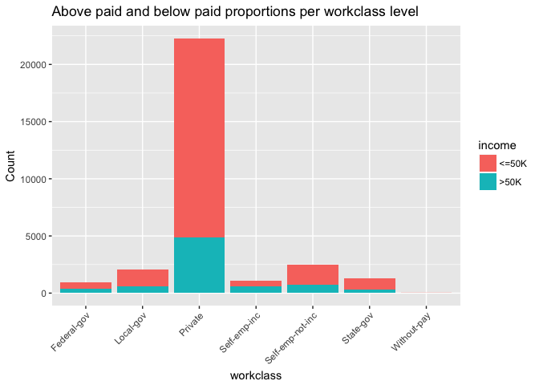<!-- -->

#### * Column percentages shows that incorporated self employed workers earn significanly more than the rest of the catergories. 
#### * The dataset has most people work in Private workclass category level, thus most people earning >50K.

### Percentages of above and below paid Per education category


```r
colPerc(xtabs(~income+education, trainDf))#Variable of Interest
```

```
##        education
## income   10th   11th   12th 1st-4th 5th-6th 7th-8th    9th Assoc-acdm
##   <=50K  92.8  94.37  92.31   96.03   95.83   93.72  94.51       74.6
##   >50K    7.2   5.63   7.69    3.97    4.17    6.28   5.49       25.4
##   Total 100.0 100.00 100.00  100.00  100.00  100.00 100.00      100.0
##        education
## income  Assoc-voc Bachelors Doctorate HS-grad Masters Preschool
##   <=50K     73.68     57.85     25.33   83.57   43.58       100
##   >50K      26.32     42.15     74.67   16.43   56.42         0
##   Total    100.00    100.00    100.00  100.00  100.00       100
##        education
## income  Prof-school Some-college
##   <=50K       25.09        79.99
##   >50K        74.91        20.01
##   Total      100.00       100.00
```

```r
education_inc <-sqldf("select education, income, count(education) as Count from trainDf group by education, income")

### Plot of above paid and below paid counts per education level

ggplot(education_inc, aes(x=education, y=Count, fill=income)) + 
  geom_bar(stat="identity") +
  theme(axis.text.x = element_text(angle = 45, hjust = 1)) +
  ggtitle('Above paid and below paid proportions per education level')
```

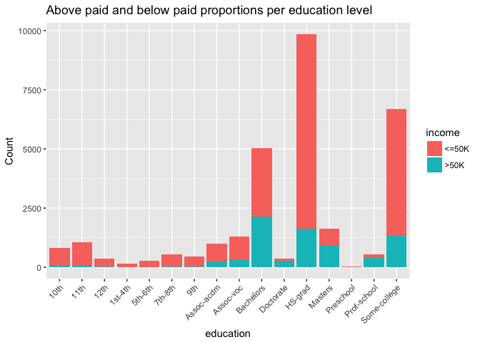<!-- -->

#### * As education level increases, the probability of of getting paid >50K increases. Higher education levels like Bachlors to PhD significanly contribute to higher pay grades.

###Marital_status: High income earners are married and living with spouse, good marital relationship.

```r
colPerc(xtabs(~income+marital_status, trainDf))#Variable of Interest
```

```
##        marital_status
## income  Divorced Married-AF-spouse Married-civ-spouse
##   <=50K    89.27             52.38               54.5
##   >50K     10.73             47.62               45.5
##   Total   100.00            100.00              100.0
##        marital_status
## income  Married-spouse-absent Never-married Separated Widowed
##   <=50K                 91.62         95.17     92.97   90.33
##   >50K                   8.38          4.83      7.03    9.67
##   Total                100.00        100.00    100.00  100.00
```

```r
maritalStatus_inc <-sqldf("select marital_status, income, count(marital_status) as Count from trainDf group by marital_status, income")
# Plot of above paid and below paid counts per marital_status level
ggplot(maritalStatus_inc, aes(x=marital_status, y=Count, fill=income)) + 
  geom_bar(stat="identity") +
  theme(axis.text.x = element_text(angle = 45, hjust = 1)) +
  ggtitle('Above paid and below paid proportions per marital_status level')
```

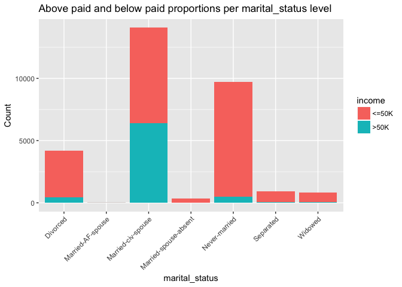<!-- -->


### Occupation: High earner are likely be working in executive managerial and professional specialty occupataions.

```r
colPerc(xtabs(~income+occupation, trainDf))
```

```
##        occupation
## income  Adm-clerical Armed-Forces Craft-repair Exec-managerial
##   <=50K        86.62        88.89        77.47           51.48
##   >50K         13.38        11.11        22.53           48.52
##   Total       100.00       100.00       100.00          100.00
##        occupation
## income  Farming-fishing Handlers-cleaners Machine-op-inspct Other-service
##   <=50K           88.37             93.85             87.54         95.89
##   >50K            11.63              6.15             12.46          4.11
##   Total          100.00            100.00            100.00        100.00
##        occupation
## income  Priv-house-serv Prof-specialty Protective-serv  Sales Tech-support
##   <=50K            99.3          55.15           67.39  72.94        69.52
##   >50K              0.7          44.85           32.61  27.06        30.48
##   Total           100.0         100.00          100.00 100.00       100.00
##        occupation
## income  Transport-moving
##   <=50K            79.71
##   >50K             20.29
##   Total           100.00
```

```r
rowPerc(xtabs(~income+occupation, trainDf))
```

```
##        occupation
## income  Adm-clerical Armed-Forces Craft-repair Exec-managerial
##   <=50K        14.23         0.04        13.78            9.07
##   >50K          6.63         0.01        12.09           25.80
##        occupation
## income  Farming-fishing Handlers-cleaners Machine-op-inspct Other-service
##   <=50K            3.86              5.59              7.60         13.60
##   >50K             1.53              1.11              3.26          1.76
##        occupation
## income  Priv-house-serv Prof-specialty Protective-serv  Sales Tech-support
##   <=50K            0.63           9.83            1.92  11.54         2.80
##   >50K             0.01          24.12            2.80  12.92         3.70
##        occupation
## income  Transport-moving  Total
##   <=50K             5.53 100.00
##   >50K              4.25 100.00
```

```r
occupation_inc <-sqldf("select occupation, income, count(occupation) as Count from trainDf group by occupation, income")
# Plot of above paid and below paid counts per education level
ggplot(occupation_inc, aes(x=occupation, y=Count, fill=income)) + 
  geom_bar(stat="identity") +
  theme(axis.text.x = element_text(angle = 45, hjust = 1)) +
  ggtitle('Above paid and below paid proportions per occupation level')
```

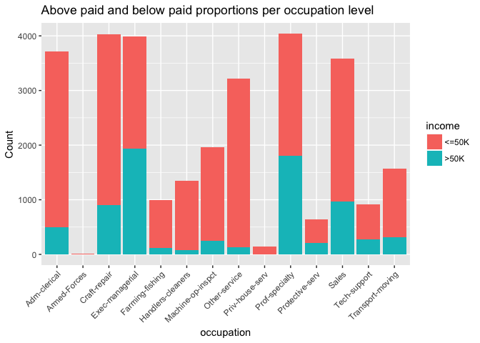<!-- -->


### Race: High earner are more likely to be Asian pacific islanders and whites. 

```r
colPerc(xtabs(~income+race, trainDf))#Variable of Interest
```

```
##        race
## income  Amer-Indian-Eskimo Asian-Pac-Islander  Black  Other  White
##   <=50K              88.11              72.29  87.01  90.91  73.63
##   >50K               11.89              27.71  12.99   9.09  26.37
##   Total             100.00             100.00 100.00 100.00 100.00
```

```r
rowPerc(xtabs(~income+race, trainDf))
```

```
##        race
## income  Amer-Indian-Eskimo Asian-Pac-Islander  Black  Other  White  Total
##   <=50K               1.11               2.86  10.82   0.93  84.29 100.00
##   >50K                0.45               3.30   4.87   0.28  91.09 100.00
```

```r
race_inc <-sqldf("select race, income, count(race) as Count from trainDf group by race, income")
# Plot of above paid and below paid counts per race level
ggplot(race_inc, aes(x=race, y=Count, fill=income)) + 
  geom_bar(stat="identity") +
  theme(axis.text.x = element_text(angle = 45, hjust = 1)) +
  ggtitle('Above paid and below paid proportions per race level')
```

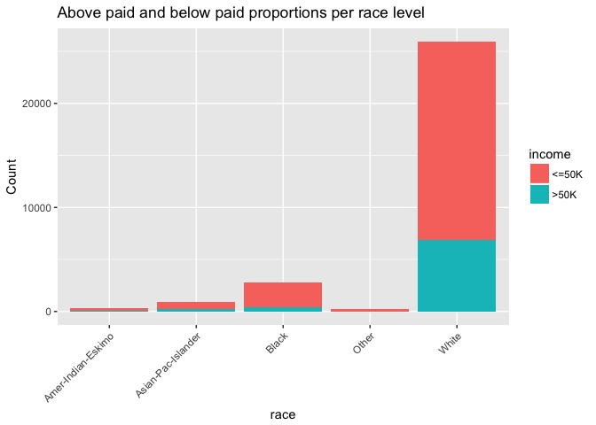<!-- -->

####Sex: High paid workers are much more Likely to be Male, men tend to earn more moeny than women.

```r
colPerc(xtabs(~income+sex, trainDf))
```

```
##        sex
## income  Female   Male
##   <=50K  88.63  68.62
##   >50K   11.37  31.38
##   Total 100.00 100.00
```

```r
rowPerc(xtabs(~income+sex, trainDf))
```

```
##        sex
## income  Female   Male  Total
##   <=50K  38.27  61.73 100.00
##   >50K   14.81  85.19 100.00
```

```r
sex_inc <-sqldf("select sex, income, count(sex) as Count from trainDf group by sex, income")
# Plot of above paid and below paid counts per sex level
ggplot(sex_inc, aes(x=sex, y=Count, fill=income)) + 
  geom_bar(stat="identity") +
  theme(axis.text.x = element_text(angle = 45, hjust = 1)) +
  ggtitle('Above paid and below paid proportions per sex level')
```

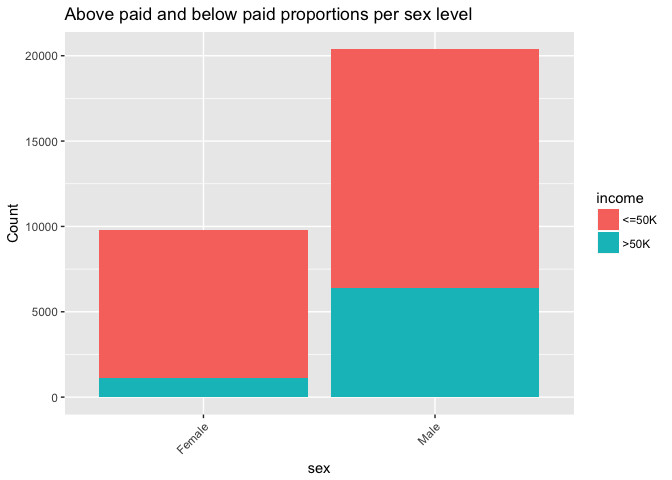<!-- -->

#### Global_region: people from central_subcontinent_asia region are high earners.

```r
colPerc(xtabs(~income+ global_region, trainDf))#Variable of Interest
```

```
##        global_region
## income  canada central_carribean_america central_subcontinent_asia
##   <=50K  66.36                      91.6                     59.15
##   >50K   33.64                       8.4                     40.85
##   Total 100.00                     100.0                    100.00
##        global_region
## income  country_labeled_as_south east_asia eastern_europe south_america
##   <=50K                    80.28     70.53          76.47         92.92
##   >50K                     19.72     29.47          23.53          7.08
##   Total                   100.00    100.00         100.00        100.00
##        global_region
## income  united_states western_europe
##   <=50K         74.58          68.38
##   >50K          25.42          31.62
##   Total        100.00         100.00
```

```r
rowPerc(xtabs(~income+ global_region, trainDf))
```

```
##        global_region
## income  canada central_carribean_america central_subcontinent_asia
##   <=50K   0.31                      4.96                      0.37
##   >50K    0.48                      1.37                      0.77
##        global_region
## income  country_labeled_as_south east_asia eastern_europe south_america
##   <=50K                     0.25      1.53           0.29          0.46
##   >50K                      0.19      1.93           0.27          0.11
##        global_region
## income  united_states western_europe  Total
##   <=50K         90.59           1.23 100.00
##   >50K          93.17           1.72 100.00
```

```r
region_inc <-sqldf("select global_region, income, count(global_region) as Count from trainDf group by global_region, income")
# Plot of above paid and below paid counts per race level
ggplot(region_inc, aes(x=global_region, y=Count, fill=income)) + 
  geom_bar(stat="identity") +
  theme(axis.text.x = element_text(angle = 45, hjust = 1)) +
  ggtitle('Above paid and below paid proportions per global_region level')
```

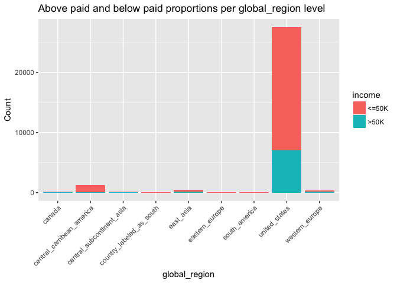<!-- -->

#### Summary stats by above and below paid groups for Continuous variables


```r
aggregate(trainDf$capital_gain~trainDf$income,data=trainDf,summary)
```

```
##   trainDf$income trainDf$capital_gain.Min. trainDf$capital_gain.1st Qu.
## 1          <=50K                    0.0000                       0.0000
## 2           >50K                    0.0000                       0.0000
##   trainDf$capital_gain.Median trainDf$capital_gain.Mean
## 1                      0.0000                  148.8938
## 2                      0.0000                 3937.6798
##   trainDf$capital_gain.3rd Qu. trainDf$capital_gain.Max.
## 1                       0.0000                41310.0000
## 2                       0.0000                99999.0000
```

```r
qplot(capital_gain, data=trainDf, geom="histogram")+theme_bw()+ggtitle('Histogram of Capital Gain')
```

```
## `stat_bin()` using `bins = 30`. Pick better value with `binwidth`.
```

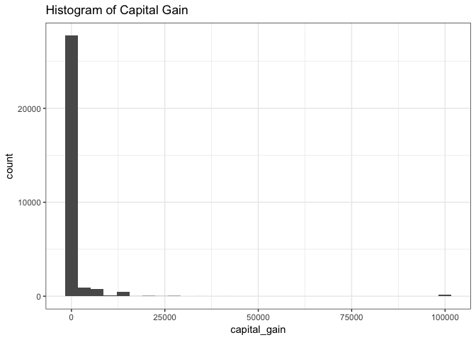<!-- -->

```r
aggregate(trainDf$capital_loss~trainDf$income,data=trainDf,summary)
```

```
##   trainDf$income trainDf$capital_loss.Min. trainDf$capital_loss.1st Qu.
## 1          <=50K                    0.0000                       0.0000
## 2           >50K                    0.0000                       0.0000
##   trainDf$capital_loss.Median trainDf$capital_loss.Mean
## 1                      0.0000                   53.4480
## 2                      0.0000                  193.7507
##   trainDf$capital_loss.3rd Qu. trainDf$capital_loss.Max.
## 1                       0.0000                 4356.0000
## 2                       0.0000                 3683.0000
```

```r
qplot(capital_loss, data=trainDf, geom="histogram")+theme_bw()+ggtitle('Histogram of Capital Loss')
```

```
## `stat_bin()` using `bins = 30`. Pick better value with `binwidth`.
```

<!-- -->

#### Age: Boxplot of Age shows people who earn >50k are between age of 36 to 51 with 43 as the median

```r
boxplot(age~income,trainDf,main="Boxplot of Age")
```

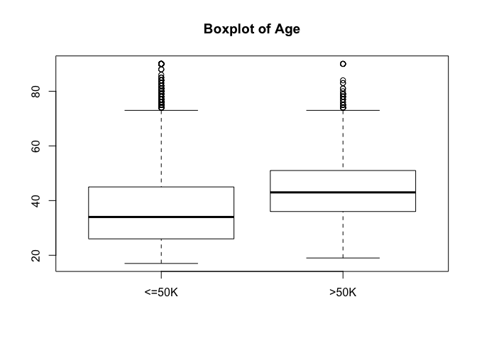<!-- -->

```r
aggregate(trainDf$age~trainDf$income,data=trainDf,summary)
```

```
##   trainDf$income trainDf$age.Min. trainDf$age.1st Qu. trainDf$age.Median
## 1          <=50K         17.00000            26.00000           34.00000
## 2           >50K         19.00000            36.00000           43.00000
##   trainDf$age.Mean trainDf$age.3rd Qu. trainDf$age.Max.
## 1         36.60806            45.00000         90.00000
## 2         43.95911            51.00000         90.00000
```

###Examine the correlation between the continous predictors
#####The scatterplots and correlation matrix shows no significant correlation between any of the continuous variables
####pairs(trainDf[,c("age","education_num","hours_per_week", "capital_gain", "capital_loss")])


```r
my_cor<-cor(trainDf[,c("age","education_num","hours_per_week", "capital_gain", "capital_loss")])
my_cor
```

```
##                       age education_num hours_per_week capital_gain
## age            1.00000000    0.04352609     0.10159876   0.08015423
## education_num  0.04352609    1.00000000     0.15252207   0.12441600
## hours_per_week 0.10159876    0.15252207     1.00000000   0.08043180
## capital_gain   0.08015423    0.12441600     0.08043180   1.00000000
## capital_loss   0.06016548    0.07964641     0.05241705  -0.03222933
##                capital_loss
## age              0.06016548
## education_num    0.07964641
## hours_per_week   0.05241705
## capital_gain    -0.03222933
## capital_loss     1.00000000
```


##### when I ran logistic regression code on a modified train dataset made up of equal obs for high income and low income(as per Dr. Turner's suggestion to get a good prediction model using this type of stratified sampling method), the sample workclass and occupation variables had atleast one level with Zero observations. Thus I am sampling equla proportions of oservations for high and low income

```r
trainTest <- rbind(trainDf, testDf)
ftable(addmargins(table(trainTest$income,trainTest$occupation))) 
```

```
##        Adm-clerical Armed-Forces Craft-repair Exec-managerial Farming-fishing Handlers-cleaners Machine-op-inspct Other-service Priv-house-serv Prof-specialty Protective-serv Sales Tech-support Transport-moving   Sum
##                                                                                                                                                                                                                         
## <=50K          4784           10         4665            3117            1308              1911              2605          4612             229           3304             669  3953         1009             1838 34014
## >50K            756            4         1355            2867             172               135               365           196               3           2704             307  1455          411              478 11208
## Sum            5540           14         6020            5984            1480              2046              2970          4808             232           6008             976  5408         1420             2316 45222
```

```r
ftable(addmargins(table(trainTest$income,trainTest$workclass)))
```

```
##        Federal-gov Local-gov Private Self-emp-inc Self-emp-not-inc State-gov Without-pay   Sum
##                                                                                               
## <=50K          857      2185   26056          734             2737      1426          19 34014
## >50K           549       915    7251          912             1059       520           2 11208
## Sum           1406      3100   33307         1646             3796      1946          21 45222
```

```r
noPayobs<-trainTest[which(trainTest$workclass=="Without-pay"),]
```

#####I decided to not include "relationship" factor variable since it seems redundant and for the sake of simplicity of the model.From the summary of this dataset, it seems that marital_status and sex variables are capturing the information provided by "relationship" variable. To build the predictive model to predict who earn more than 50 K per annum, we decided to include age, workclass, education_num, marital_status, occupation, race, sex, capital_gain, capital_loss, hours_per_week, global_region after reviewing plots and the summary stats for all the variables.

```r
trainDf2 <-subset(trainDf, select=c("age", "workclass", "education_num", "marital_status", "occupation", "race", "sex", "capital_gain", "capital_loss", "hours_per_week", "global_region", "income"))
testDf2 <-subset(testDf, select=c("age", "workclass", "education_num", "marital_status", "occupation", "race", "sex", "capital_gain", "capital_loss", "hours_per_week", "global_region", "income"))
noPayobs <-subset(noPayobs, select=c("age", "workclass", "education_num", "marital_status", "occupation", "race", "sex", "capital_gain", "capital_loss", "hours_per_week", "global_region", "income"))
#summary(trainDf2)

above50k <- trainDf2[trainDf2$income==">50K",]
below50k <- trainDf2[trainDf2$income=="<=50K",]


set.seed(111)

sampleBelow50 <- below50k[sample(nrow(below50k), size = 7508), ]
trainDf3 <-rbind(sampleBelow50, above50k, noPayobs)
```

####making sure that each category level of each categorical variable is represented in the sampled train data

```r
xtabs(~income+workclass, data = trainDf3)
```

```
##        workclass
## income  Federal-gov Local-gov Private Self-emp-inc Self-emp-not-inc
##   <=50K         194       463    5798          149              576
##   >50K          365       609    4876          600              714
##        workclass
## income  State-gov Without-pay
##   <=50K       325          22
##   >50K        344           2
```

```r
xtabs(~income+marital_status, data = trainDf3)
```

```
##        marital_status
## income  Divorced Married-AF-spouse Married-civ-spouse
##   <=50K     1226                 2               2477
##   >50K       452                10               6401
##        marital_status
## income  Married-spouse-absent Never-married Separated Widowed
##   <=50K                   128          3143       294     257
##   >50K                     31           470        66      80
```

```r
xtabs(~income+occupation, data = trainDf3)
```

```
##        occupation
## income  Adm-clerical Armed-Forces Craft-repair Exec-managerial
##   <=50K         1043            3         1017             740
##   >50K           498            1          908            1937
##        occupation
## income  Farming-fishing Handlers-cleaners Machine-op-inspct Other-service
##   <=50K             270               421               567          1045
##   >50K              115                84               246           132
##        occupation
## income  Priv-house-serv Prof-specialty Protective-serv Sales Tech-support
##   <=50K              45            743             124   876          191
##   >50K                1           1811             210   970          278
##        occupation
## income  Transport-moving
##   <=50K              442
##   >50K               319
```

```r
xtabs(~income+race, data = trainDf3)
```

```
##        race
## income  Amer-Indian-Eskimo Asian-Pac-Islander Black Other White
##   <=50K                 87                211   837    71  6321
##   >50K                  34                248   366    21  6841
```

```r
xtabs(~income+sex, data = trainDf3)
```

```
##        sex
## income  Female Male
##   <=50K   2917 4610
##   >50K    1113 6397
```

```r
xtabs(~income+global_region, data = trainDf3)
```

```
##        global_region
## income  canada central_carribean_america central_subcontinent_asia
##   <=50K     21                       388                        24
##   >50K      36                       103                        58
##        global_region
## income  country_labeled_as_south east_asia eastern_europe south_america
##   <=50K                       18       110             15            32
##   >50K                        14       145             20             8
##        global_region
## income  united_states western_europe
##   <=50K          6820             99
##   >50K           6997            129
```

###Logistic regression


```r
trainDf3$income<-ifelse(trainDf3$income=='>50K',1,0)
testDf2$income<-ifelse(testDf2$income=='>50K',1,0)
mymodel<- multinom(income~., data = trainDf3)
```

```
## # weights:  45 (44 variable)
## initial  value 10422.854154 
## iter  10 value 6748.191807
## iter  20 value 6206.246270
## iter  30 value 5857.703832
## iter  40 value 5796.993572
## iter  50 value 5789.518561
## final  value 5789.515465 
## converged
```

#### Goodness of fit test: This model is statistically significant


```r
#To get ready-made z-values and p-values for the coeffients and to get Goodness-of-fit test ran the same model using glm funtion.

#Residual Deviance: 11579.03 and AIC: 11667.03 are exactly same for both models using differnt R packages
model2<-glm(income~., data = trainDf3, family = "binomial")
```

```
## Warning: glm.fit: fitted probabilities numerically 0 or 1 occurred
```

```r
summary(model2)
```

```
## 
## Call:
## glm(formula = income ~ ., family = "binomial", data = trainDf3)
## 
## Deviance Residuals: 
##     Min       1Q   Median       3Q      Max  
## -4.5312  -0.5208  -0.0077   0.6061   3.5564  
## 
## Coefficients:
##                                          Estimate Std. Error z value
## (Intercept)                            -7.648e+00  5.300e-01 -14.431
## age                                     3.411e-02  2.249e-03  15.168
## workclassLocal-gov                     -6.092e-01  1.479e-01  -4.120
## workclassPrivate                       -3.684e-01  1.230e-01  -2.995
## workclassSelf-emp-inc                  -1.905e-01  1.684e-01  -1.131
## workclassSelf-emp-not-inc              -7.194e-01  1.440e-01  -4.995
## workclassState-gov                     -8.197e-01  1.619e-01  -5.063
## workclassWithout-pay                   -2.697e+00  7.905e-01  -3.412
## education_num                           2.834e-01  1.250e-02  22.677
## marital_statusMarried-AF-spouse         4.107e+00  8.435e-01   4.869
## marital_statusMarried-civ-spouse        2.205e+00  8.025e-02  27.470
## marital_statusMarried-spouse-absent    -2.553e-01  2.660e-01  -0.960
## marital_statusNever-married            -5.415e-01  9.616e-02  -5.631
## marital_statusSeparated                -1.332e-01  1.847e-01  -0.721
## marital_statusWidowed                  -1.108e-01  1.785e-01  -0.621
## occupationArmed-Forces                 -1.575e+00  1.958e+00  -0.804
## occupationCraft-repair                 -9.651e-02  1.008e-01  -0.958
## occupationExec-managerial               6.030e-01  9.701e-02   6.216
## occupationFarming-fishing              -1.307e+00  1.723e-01  -7.586
## occupationHandlers-cleaners            -7.740e-01  1.717e-01  -4.507
## occupationMachine-op-inspct            -3.500e-01  1.252e-01  -2.795
## occupationOther-service                -9.108e-01  1.380e-01  -6.600
## occupationPriv-house-serv              -5.633e+00  1.658e+00  -3.396
## occupationProf-specialty                5.145e-01  1.018e-01   5.054
## occupationProtective-serv               7.669e-01  1.736e-01   4.418
## occupationSales                         1.431e-01  1.043e-01   1.372
## occupationTech-support                  6.030e-01  1.463e-01   4.120
## occupationTransport-moving             -2.822e-01  1.238e-01  -2.279
## raceAsian-Pac-Islander                  8.675e-01  3.415e-01   2.540
## raceBlack                               6.555e-01  2.825e-01   2.320
## raceOther                               8.724e-02  4.487e-01   0.194
## raceWhite                               7.905e-01  2.691e-01   2.937
## sexMale                                 2.004e-01  6.598e-02   3.036
## capital_gain                            3.198e-04  1.502e-05  21.289
## capital_loss                            6.489e-04  5.461e-05  11.882
## hours_per_week                          3.574e-02  2.318e-03  15.418
## global_regioncentral_carribean_america -7.707e-01  4.177e-01  -1.845
## global_regioncentral_subcontinent_asia -3.172e-01  5.457e-01  -0.581
## global_regioncountry_labeled_as_south  -1.449e+00  7.066e-01  -2.050
## global_regioneast_asia                 -4.925e-01  4.703e-01  -1.047
## global_regioneastern_europe             2.865e-01  5.897e-01   0.486
## global_regionsouth_america             -1.860e+00  6.720e-01  -2.768
## global_regionunited_states             -4.342e-01  3.866e-01  -1.123
## global_regionwestern_europe            -2.448e-01  4.280e-01  -0.572
##                                        Pr(>|z|)    
## (Intercept)                             < 2e-16 ***
## age                                     < 2e-16 ***
## workclassLocal-gov                     3.80e-05 ***
## workclassPrivate                       0.002746 ** 
## workclassSelf-emp-inc                  0.257999    
## workclassSelf-emp-not-inc              5.88e-07 ***
## workclassState-gov                     4.12e-07 ***
## workclassWithout-pay                   0.000646 ***
## education_num                           < 2e-16 ***
## marital_statusMarried-AF-spouse        1.12e-06 ***
## marital_statusMarried-civ-spouse        < 2e-16 ***
## marital_statusMarried-spouse-absent    0.337260    
## marital_statusNever-married            1.79e-08 ***
## marital_statusSeparated                0.470877    
## marital_statusWidowed                  0.534785    
## occupationArmed-Forces                 0.421224    
## occupationCraft-repair                 0.338179    
## occupationExec-managerial              5.10e-10 ***
## occupationFarming-fishing              3.30e-14 ***
## occupationHandlers-cleaners            6.56e-06 ***
## occupationMachine-op-inspct            0.005190 ** 
## occupationOther-service                4.11e-11 ***
## occupationPriv-house-serv              0.000683 ***
## occupationProf-specialty               4.33e-07 ***
## occupationProtective-serv              9.98e-06 ***
## occupationSales                        0.169933    
## occupationTech-support                 3.78e-05 ***
## occupationTransport-moving             0.022677 *  
## raceAsian-Pac-Islander                 0.011079 *  
## raceBlack                              0.020325 *  
## raceOther                              0.845819    
## raceWhite                              0.003309 ** 
## sexMale                                0.002394 ** 
## capital_gain                            < 2e-16 ***
## capital_loss                            < 2e-16 ***
## hours_per_week                          < 2e-16 ***
## global_regioncentral_carribean_america 0.065010 .  
## global_regioncentral_subcontinent_asia 0.560998    
## global_regioncountry_labeled_as_south  0.040363 *  
## global_regioneast_asia                 0.295017    
## global_regioneastern_europe            0.627083    
## global_regionsouth_america             0.005648 ** 
## global_regionunited_states             0.261355    
## global_regionwestern_europe            0.567367    
## ---
## Signif. codes:  0 '***' 0.001 '**' 0.01 '*' 0.05 '.' 0.1 ' ' 1
## 
## (Dispersion parameter for binomial family taken to be 1)
## 
##     Null deviance: 20846  on 15036  degrees of freedom
## Residual deviance: 11579  on 14993  degrees of freedom
## AIC: 11667
## 
## Number of Fisher Scoring iterations: 7
```

```r
#Goodness of fit test: This model is statistically significant
with(model2, pchisq(null.deviance-deviance, df.null-df.residual, lower.tail = F ))
```

```
## [1] 0
```

##### See whether predProb(prediction Probalbilties) matches with actual data and it does for atleast first 6 obs


```r
predProb <- predict(mymodel, trainDf3, type = "prob")
#hist(predProb)
head(predProb)
```

```
##       17820       21836       11138       15479       11358       12584 
## 0.260743888 0.007439307 0.087228461 0.098804655 0.042667425 0.061326311
```

```r
head(trainDf3)
```

```
##       age        workclass education_num        marital_status
## 17820  30        Local-gov            10         Never-married
## 21836  19          Private            10         Never-married
## 11138  25          Private            13         Never-married
## 15479  60          Private            10               Widowed
## 11358  28          Private             9 Married-spouse-absent
## 12584  29 Self-emp-not-inc            12         Never-married
##              occupation               race    sex capital_gain
## 17820   Protective-serv              Black   Male            0
## 21836     Other-service              White   Male            0
## 11138      Adm-clerical              Black   Male            0
## 15479             Sales              White Female            0
## 11358 Machine-op-inspct Asian-Pac-Islander   Male            0
## 12584     Other-service              White   Male            0
##       capital_loss hours_per_week global_region income
## 17820         1974             40 united_states      0
## 21836            0             15 united_states      0
## 11138            0             35 united_states      0
## 15479            0             15 united_states      0
## 11358            0             40     east_asia      0
## 12584            0             60 united_states      0
```

```r
predProb <- prediction(predProb, trainDf3$income)
perfEval <- performance(predProb, "acc")
plot(perfEval)
```

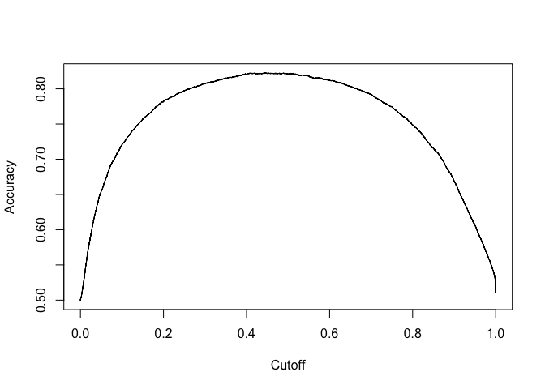<!-- -->

```r
maxYval <- which.max(slot(perfEval, "y.values")[[1]])
maxYval
```

```
## [1] 7192
```

```r
acc <- slot(perfEval, "y.values")[[1]][maxYval]
acc
```

```
## [1] 0.822571
```

##### Thus, the accuracy of the logistic regression on Train data is 82.26%

#### ROC on Train data

```r
roc <- performance(predProb, "tpr", "fpr")
plot(roc)
#abline(a= 0, b=1)


####  AUC(Area Under Curve) on Train data 

auc <- performance(predProb, "auc")
auc<- unlist(slot(auc, "y.values"))
auc # area under the curve for train is .9062
```

```
## [1] 0.9061692
```

```r
legend(.4,.4, auc, title= "AUC")
```

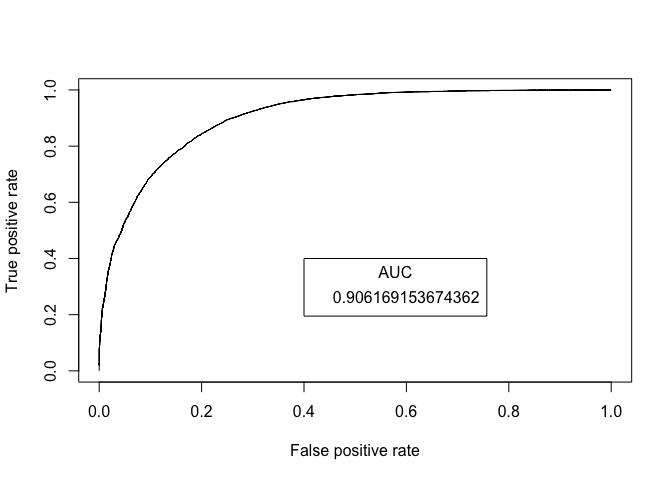<!-- -->

#### ROC on Test data


```r
myTstmodel<- multinom(income~., data = trainDf3)
```

```
## # weights:  45 (44 variable)
## initial  value 10422.854154 
## iter  10 value 6748.191807
## iter  20 value 6206.246270
## iter  30 value 5857.703832
## iter  40 value 5796.993572
## iter  50 value 5789.518561
## final  value 5789.515465 
## converged
```

```r
predProbTst <- predict(myTstmodel, testDf2, type = "prob")
#hist(predProbTst)

#see whether predProb(prediction Probalbilties) matches with actual data and it does for atleast first 6 obs
head(predProbTst)
```

```
##           1           2           3           4           5           6 
## 0.014485409 0.283231347 0.742062305 0.922924922 0.006830299 0.969075035
```

```r
head(testDf2)
```

```
##   age        workclass education_num     marital_status        occupation
## 1  25          Private             7      Never-married Machine-op-inspct
## 2  38          Private             9 Married-civ-spouse   Farming-fishing
## 3  28        Local-gov            12 Married-civ-spouse   Protective-serv
## 4  44          Private            10 Married-civ-spouse Machine-op-inspct
## 5  34          Private             6      Never-married     Other-service
## 6  63 Self-emp-not-inc            15 Married-civ-spouse    Prof-specialty
##    race  sex capital_gain capital_loss hours_per_week global_region income
## 1 Black Male            0            0             40 united_states      0
## 2 White Male            0            0             50 united_states      0
## 3 White Male            0            0             40 united_states      1
## 4 Black Male         7688            0             40 united_states      1
## 5 White Male            0            0             30 united_states      0
## 6 White Male         3103            0             32 united_states      1
```

```r
predProbTst <- prediction(predProbTst, testDf2$income)
perfEvalTst <- performance(predProbTst, "acc")
plot(perfEvalTst)
```

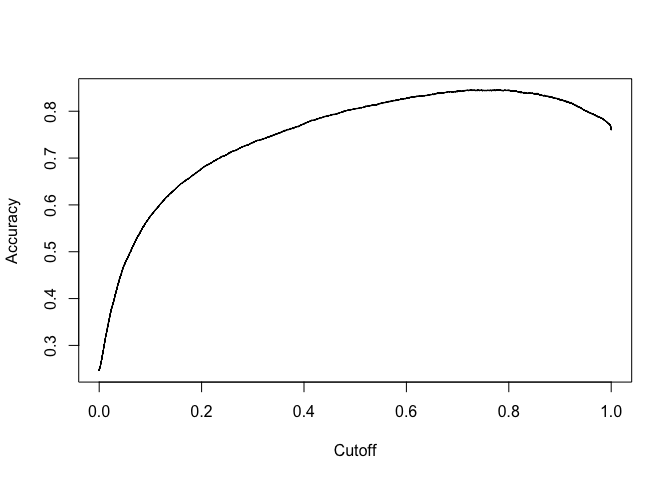<!-- -->

```r
maxYvalTst <- which.max(slot(perfEvalTst, "y.values")[[1]])
maxYvalTst
```

```
## [1] 2628
```

```r
accTst <- slot(perfEvalTst, "y.values")[[1]][maxYvalTst]
accTst ## thus the accuracy of the logistic regression on test data is 84.54%
```

```
## [1] 0.8454183
```

##### Thus, the accuracy of the logistic regression on test data is 84.54%.


```r
# ROC test
rocTst <- performance(predProbTst, "tpr", "fpr")
plot(rocTst)
#abline(a= 0, b=1)

#####  AUC(Area Under Curve) on Test data 

aucTst <- performance(predProbTst, "auc")
aucTst<- unlist(slot(aucTst, "y.values"))
aucTst #  area under the curve for train is 0.90135
```

```
## [1] 0.9013595
```

```r
legend(.4,.4, aucTst, title= "AUC")
```

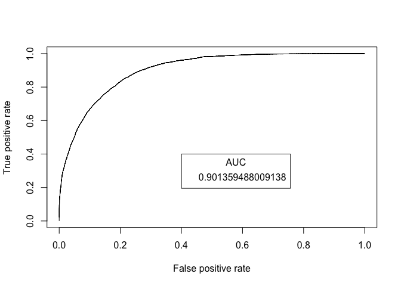<!-- -->
